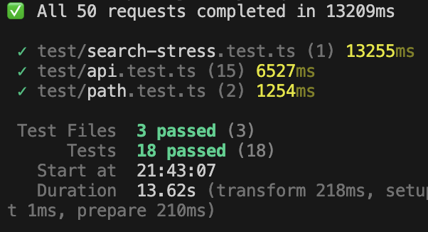

<div align="center">
  
  <h1>Maizebus Backend</h1>

  <p>
    <a href="https://mbusdev.github.io/mbus-backend-dev/">
      
    </a>
    
  </p>

  <p>
    Backend service for the Magic Bus application. Handles real-time bus tracking, route management, and multi-modal journey planning (bus + walking) using the McRaptor algorithm.
  </p>
</div>

## Setup

First, obtain an API key for the Magic Bus backend from [the official Magic Bus Website](https://mbus.ltp.umich.edu/dev-account).

Then, define the `MBUS_API_KEY` environment variable with your API key.

To install dependencies, run `npm i`

## (WIP) Firebase (Push Notifications) Setup

Create a Firebase project if you haven't already, and set `FIREBASE_PROJECT_ID` to its id. Follow the steps
[here](https://firebase.google.com/docs/admin/setup#initialize_the_sdk_in_non-google_environments) to create a service
account key file. Place this file into `secrets/` and point `GOOGLE_APPLICATION_CREDENTIALS` to it. 
(you can do this temporarily with export GOOGLE_APPLICATION_CREDENTIALS="./secrets/your-filename.json")

Some additional resources for iOS [here](https://firebase.flutter.dev/docs/messaging/apple-integration/). Make
sure that the firebase project is configured with the same app id as xcode.

## Running the Backend

To run the backend, run `npm start`.

By default, the service runs on port 3000. To define a port for the service to run on, define an environment variable called `PORT` before running the backend.

## Documentation

This project uses TSDoc for code documentation.
To compile the static documentation:
```bash
npm run docs
```
The documentation is served at `http://localhost:3000/docs` or this [link](https://mbusdev.github.io/mbus-backend-dev/).

## Tests

This project uses **Vitest** for fast unit and integration testing.

- Run all tests: `npm test`
- Run stress tests: `npm run stress-test`

An example of passing the tests is below.




## Contributing
Before submitting a pull request to main, please make sure you pass all the tests and can compile docs. If you believe some of the tests faulty or no longer needed after your commit, please contact Andrew Yu or Ryan Lu on Slack.